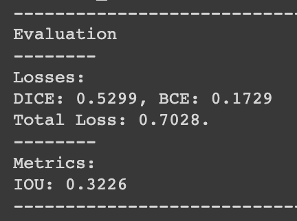
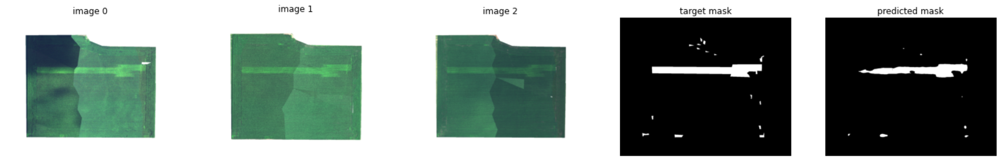
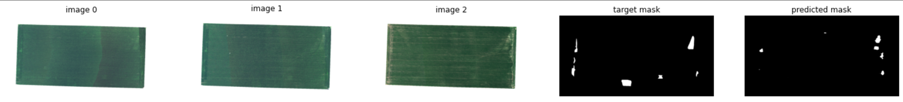

# Nutrient-Deficiency-Stress-Segmentation

This repository contains an implementation of a UNet-based model for segmentation of Nutrient Deficiency Stress (see [paper](https://arxiv.org/abs/2012.09654)).

### Dataset
The dataset is available at the [link](https://registry.opendata.aws/intelinair_longitudinal_nutrient_deficiency/).

### Model
The model is based on the custom UNet architecture (see [model.py](https://github.com/artem-gorodetskii/Nutrient-Deficiency-Stress-Segmentation/blob/master/model.py)). The input to the model represents a combination of three RGB images.

The model was trained using Google Colab, all outputs can be found in the [colab_notebook](https://github.com/artem-gorodetskii/Nutrient-Deficiency-Stress-Segmentation/blob/master/colab_notebook.ipynb). The pretrained model is avalible in the "pretrained" directory.

### Evaluation
The dataset containing 386 flights was randomly separated on 328 train and 58 validation flights. The model was trained for only 26 epochs (see [train.py](https://github.com/artem-gorodetskii/Nutrient-Deficiency-Stress-Segmentation/blob/master/train.py) and [config.py](https://github.com/artem-gorodetskii/Nutrient-Deficiency-Stress-Segmentation/blob/master/config.py) for detail). 

The evalutaion results on validation data:

  

### Inference Example
Inference examples can be found in the notebook [inference_examples](https://github.com/artem-gorodetskii/Nutrient-Deficiency-Stress-Segmentation/blob/master/inference_example.ipynb).

Example 1 (validation data):

  

Example 2 (validation data):

  

